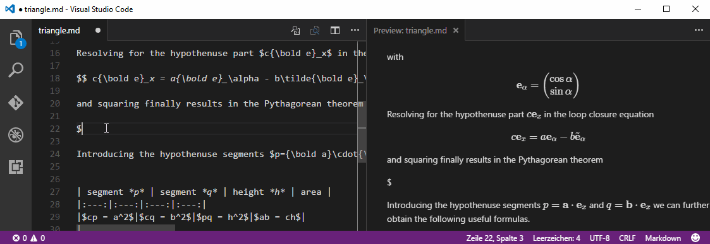

#  Markdown+Math

[](https://github.com/goessner/mdmath/blob/master/LICENSE.txt)
[](https://www.npmjs.com/package/mdmath)
[](https://www.npmjs.com/package/mdmath)

## What is it ...

**mdmath** allows to use *Visual Studio Code* as a markdown editor capable of typesetting and rendering TeX math.
In fact it functions and renders identically to the built in markdown viewer. Additionally KaTeX works inside as a fast math renderer.

You can install the extension directly from [Visual Studio Code Marketplace](https://marketplace.visualstudio.com/items?itemName=goessner.mdmath).

### What is new in **mdmath** ...

* Support of table of Contents
* Support of Front Matter (YAML or JSON style)
* User Stylesheet
* User Settings




## Features
Simplify the process of authoring and live previewing markdown documents containing math formulas.
This extension is a comfortable tool for scientists, engineers and students with markdown as their first choice 
document format.

* Inline math by `$ ... $`
* Display math by `$$ ... $$`
* Add formula numbering by `$$ ... $$ (1)`
* Inline math with tables
* Embedded HTML
* Syntax highlighting with code sections
* Export resulting HTML code for web usage

## Test Table

Some math expressions are collected in a [test table](http://goessner.github.io/mdmath/test/).

## Installation ...

### ... from inside of VSCode

Press <kbd>F1</kbd> key inside of *Visual Studio Code* and type `extension`. Choose `Extensions: Install Extension` 
and then select the `Markdown+Math` extension from the list.

### ... from Mac & Linux Command Line
```
cd $HOME/.vscode/extensions
git clone https://github.com/goessner/mdmath.git
cd mdmath
npm install
```

### ... from Windows Command Line
```
cd  %USERPROFILE%\.vscode\extensions
git clone https://github.com/goessner/mdmath.git
cd mdmath
npm install
```

## Usage

* Launch *VS Code*, create or open a markdown file (`.md`).
* Press <kbd>Ctrl+Shift+.</kbd> to open a preview window side by side, or ...
* .. alternatively press <kbd>Ctrl+Shift+P</kbd> and run the command `Markdown+Math` to achive the same.
* Typeset in your markdown source window and see the preview window live updating.
* Press <kbd>Ctrl+K .</kbd> and run the command `Clip Markdown+Math to HTML` to copy the 
  corresponding HTML source to the underlying systems clipboard.

## Default User Settings
```json
  // Path to custom stylesheet file (css).
  "mdmath.style": "",

  // Footnotes in markdown enabled.
  "mdmath.footnotes": true,

  // 'Table of Contents' generation in markdown enabled.
  "mdmath.toc.enabled": false,

  // Heading levels included in table of contents.
  "mdmath.toc.includeLevel": [2,3],

  // Add permalink symbols to headings.
  "mdmath.toc.permalink": true,

  // Begin adding permalink symbols starting from heading level.
  "mdmath.toc.permalinkLevel": 2,

  // Add permalink symbol in front of heading.
  "mdmath.toc.permalinkSymbol": "#"
```

## Dependencies

* [`markdown-it`](https://github.com/markdown-it/markdown-it): The markdown renderer also used in VS Code.
* [`katex`](https://github.com/Khan/KaTeX): This is where credits for fast rendering TeX math in HTML go to.
* [`markdown-it-footnote`](https://github.com/markdown-it/markdown-it-footnote): Using footnotes in markdown.
* [`highlight.js`](https://github.com/isagalaev/highlight.js): The code highlighter also used in VS Code.
* [`clipboardy`](https://github.com/sindresorhus/clipboardy): Access the system clipboard (copy/paste).

## FAQ

* __Which functions does KaTeX support ?__
  * See them listed at [KaTeX Reference](https://github.com/Khan/KaTeX/wiki/Function-Support-in-KaTeX).
* __The preview window does not scroll in sync with source window__
  * No. Maybe VSCode's new native preview window behavior is supported in future.
* __What if I need to use the currency symbol `$` also in my markup ?__
  * It should be safe to use it. If in doubt escape it.
* __What are the restrictions with inline formulas ?__
  * Whitespace after opening `\$` and before closing `\$` is not allowed.
  * Numeric character before opening `\$` and after closing `\$` is not allowed.
  * At least one character (whitespace ?) is required between two consecutive inline formulas.
  * Line break inside is not allowed.
* __What are the restrictions with display formulas ?__
  * Not allowed inline of text. Write them on a separate line.
  * Restrictions for inline formulas do not apply.
* __Can I use math markup in blockquotes ?__
  * We can use inline and display formulas in blockquote sections. In order to avoid the blockquote symbol `'>'` being part of a multiline display formula, display formulas have to be written on a single line in blockquote sections.
* __Can I use math markup in code blocks ?__
  * In order to prevent converting formulas in code blocks you must escape the enclosing dollars as in `\$\frac{a}{b}\$`.
* __Can I access the HTML source of the markdown file ?__
  * Yes. Use the <kbd>Markdown: Clip Markdown+Math to Html</kbd> command or the key binding (`'ctrl+K .'`). Please note, to have the markdown source window activated here (not the preview window!).
* __Can I prepend a frontmatter section to my markdown file ?__
  * Yes. That section is displayed depending on the `markdown.previewFrontMatter` setting. Its default value is `hide`, which supresses output. You can either use a *yaml* (`--- ... ---`) or a *JSON* (`{{{...}}}`) frontmatter section.
* __Is PDF output supported ?__
  * Not directly. In order to create `*.pdf` output from your Markdown you can create a `*.html` document first and print it then using a `PDF` printer or use [Pandoc](http://pandoc.org/).
* __I cannot open multiple preview windows.__
  *  Opening multiple preview windows is not possible at current. Even changing the active markdown source window doesn't update the preview window properly. Close the preview window first as a workaround here.
* __How to automatically generate a table of contents ?__
  *  Set `mdmath.toc.enabled` in user settings to `true` first. Then add the string `[[toc]]` at your document location, where you want the table of content appear. Please note, that only heading levels *two* and *three* are collected. They are prepended by a permalink symbol `#`. This behavior can also be fine tuned by user settings.
* __Can I use custom CSS styles for the preview window ?__
  *  Yes. Set `mdmath.style` in user settings to the location of your custom CSS file. Its path must be relative to this extension root.

## Thank You

The following folks helped to make `mdmath` even better.

* [TonySFU](https://github.com/TonySFU): Helped with fixing encoding problems with Chinese language under macOS when using `mdmath.clipToHtml`.
* [floatdrop](https://github.com/floatdrop): Verifying that [clipboardy](https://github.com/sindresorhus/clipboardy) is a better alternative to `copy-paste` by implementing.

## Contributing

See [`.github/CONTRIBUTING.md`](.github/CONTRIBUTING.md)

## Changelog

See [`CHANGELOG.md`](CHANGELOG.md)

## License

*Markdown+Math* for VS Code is licensed under the [MIT License](http://opensource.org/licenses/MIT)

 © [Stefan Gössner](https://github.com/goessner)
