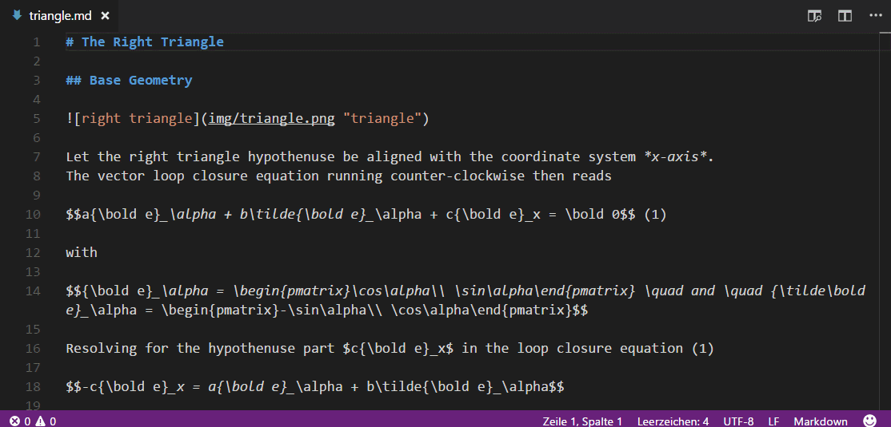
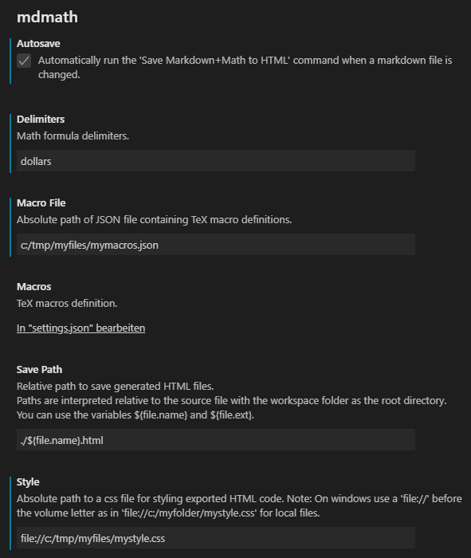

#  Markdown+Math

[](https://marketplace.visualstudio.com/items?itemName=goessner.mdmath)
[](https://marketplace.visualstudio.com/items?itemName=goessner.mdmath)
[](https://github.com/goessner/mdmath/blob/master/LICENSE.txt)
[](https://www.npmjs.com/package/mdmath)

## What is it ...

**mdmath** allows to use *Visual Studio Code* as a markdown editor capable of typesetting and rendering TeX math.
In fact it now reuses the built in markdown viewer. KaTeX works inside as a fast math renderer.

You can install the extension directly from [Visual Studio Code Marketplace](https://marketplace.visualstudio.com/items?itemName=goessner.mdmath).

### What is new in **mdmath** 2.4.0 ...
* VScode native clipboard functionality is now used for clipping HTML source to the underlying systems clipboard.
* Support for [Julia Markdown](https://docs.julialang.org/en/v1/stdlib/Markdown/) is added.
* Dependency of third party `node.js` modules is drastically reduced.
* User defined CSS style is working now.
* Allow macro definition in a user defined JSON file in addition to macro definition inside of user settings.

## Features
Simplify the process of authoring and live previewing markdown documents containing math formulas.
This extension is a comfortable tool for scientists, engineers and students with markdown as their first choice 
document format.

* Inline math
* Display math
* Formula numbering
* Inline math with tables
* Works offline.
* Integrated in native markdown viewer. So after installing the extension, TeX math is properly displayed in the markdown preview window.
* Based on [markdown-it](https://github.com/markdown-it/markdown-it) plugin [markdown-it-texmath](https://github.com/goessner/markdown-it-texmath).
* Using vscode's [Markdown Extension API](https://code.visualstudio.com/docs/extensionAPI/api-markdown).
* Editor view and Preview are synchronized while scrolling.
* Copy resulting HTML code to the system clipboard.
* Due to [markdown-it-texmath's](https://github.com/goessner/markdown-it-texmath) support of different formula delimiters, these are also available and user configurable with mdmath:
  * `'dollars'` (default)
    * inline: `$...$`
    * display: `$$...$$`
    * display + equation number: `$$...$$ (1)`
  * `'brackets'`
    * inline: `\(...\)`
    * display: `\[...\]`
    * display + equation number: `\[...\] (1)`
  * `'gitlab'`
    * inline: ``$`...`$``
    * display: `` ```math ... ``` ``
    * display + equation number: `` ```math ... ``` (1)``
  * `'julia'`
    * inline: `$...$`  or ``` ``...`` ```
    * display: `` ```math ... ``` ``
    * display + equation number: `` ```math ... ``` (1)``
  * `'kramdown'`
    * inline: ``$$...$$``
    * display: `$$...$$`
    * display + equation number: `$$...$$ (1)`



## Installation ...

### ... from inside of VSCode

Press <kbd>F1</kbd> key inside of *Visual Studio Code* and type `extension`. Choose `Extensions: Install Extension` 
and then select the `Markdown+Math` extension from the list.

### ... from Mac & Linux Command Line
```
cd $HOME/.vscode/extensions
git clone https://github.com/goessner/mdmath.git
cd mdmath
npm install
```

### ... from Windows Command Line
```
cd  %USERPROFILE%\.vscode\extensions
git clone https://github.com/goessner/mdmath.git
cd mdmath
npm install
```

## Usage

* Launch *VS Code*, create or open a markdown file (`.md`).
* Open a preview window.
* Typeset in your markdown source window and see the preview window live updating.
* Press <kbd>Ctrl</kbd>+<kbd>K</kbd><kbd>,</kbd> or run the command `Save Markdown+Math to HTML` to save the corresponding HTML source to the file system. 
* Press <kbd>Ctrl</kbd>+<kbd>K</kbd><kbd>.</kbd> or run the command `Clip Markdown+Math to HTML` to copy the corresponding HTML source to the underlying systems clipboard.

##  User Settings

###  Default Settings
```json
  "mdmath.delimiters": "dollars",
  "mdmath.macros": {},
  "mdmath.macroFile": "",
  "mdmath.savePath": "./${file.name}.html",
  "mdmath.autosave": false,
  "mdmath.style": ""
```
###  Example Settings


## Dependencies

* [`markdown-it`](https://github.com/markdown-it/markdown-it): The markdown renderer also used in VS Code.
* [`katex`](https://github.com/Khan/KaTeX): This is where credits for fast rendering TeX math in HTML go to.

## FAQ
* __How to define my own CSS file for HTML export ?__
  * Define it by the user setting `mdmath.style` as an absolute URL. So for an example you might choose `mdmath.style: "file://c:/mystyle/mystyle.css"` with windows.
* __How to define and use macros ?__
  * Define them in user settings. For example ...
  ```json
  "mdmath.macros": {
      "\\RR": "\\mathbb{R}",
      "\\vek": "{\\begin{pmatrix}#1\\\\#2\\end{pmatrix}}"
  }
  ```
  * Use them in your markdown document. For example ...
  ```
  Vectors in $\RR^2$ have a shape of

  $$\vek{x}{y}$$
  ```
* __How to define macros in a user macro file?__
  * Create a JSON file containing the macros and define its path in user settings. For example ...
  ```json
  "mdmath.macroFile": "c:/myfiles/mymacros.json"
  ```
  * Define the macros the same way as in the user settings.
  * User macro definition file has priority over user defined macro settings, which are ignored then.
* __Are there global predefined macros ?__
  * No. Macros are user defined with user settings `mdmath.macros`. So they are available in all user specific markdown documents.
* __Can I write the HTML source to a file ?__
  * Yes. Use the `Markdown: Save Markdown+Math to Html` command or the key binding <kbd>Ctrl</kbd>+<kbd>K</kbd><kbd>,</kbd>. 
  * The Html file is written to the folder where the markdown file resides in. This is the default.
  * You can change the destination folder by specifying a relative path to your working directory with the help of the user setting `mdmath.savePath`. So for an example you might choose `mdmath.savePath: "./html/${file.name}.html"`.
* __Can I synchronously let the HTML source file update ?__
  * Yes. Simply set the user setting `mdmath.autosave: true` for this (default is `false`).
  * Now, whenever you save your markdown file, the corresponding Html file is also saved.
  * The destination folder `mdmath.savePath` is used for this.

* __Formula highlighting is broken ?__
  * It is implemented only for `$` delimiters at present.
  * `$` characters in markdown text are sometimes confused with math delimiters. Enclose them by backticks (`) then.
  * Formula highlighting is possible only for formulas on a single line. It breaks with every newline character.
  * Math highlighting is completely different from LaTeX math parsing.
* __Which functions does KaTeX support ?__
  * See them listed at [KaTeX Supported Functions](https://khan.github.io/KaTeX/docs/supported.html) and [KaTeX Support Table](https://katex.org/docs/support_table.html).
* __What if I need to use the currency symbol `$` also in my markup ?__
  * It should be safe to use it. If in doubt escape it.
* __What are the restrictions with inline formulas ?__
  * Whitespace after opening `$` and before closing `$` is not allowed.
  * Numeric character before opening `$` and after closing `$` is not allowed.
  * At least one character (whitespace ?) is required between two consecutive inline formulas.
  * Line break inside is not allowed.
* __What are the restrictions with display formulas ?__
  * Not allowed inline of text.
  * Not allowed inside of tables. Use inline math there instead.
  * Blank lines before and behind required.
  * Restrictions for inline formulas do not apply.
* __Can I use math markup in blockquotes ?__
  * We can use inline and display formulas in blockquote sections. Starting with version 2.3.8 display formulas have to be written on a single line in blockquote sections. This might break only rarely some recent documents.
* __Can I use math markup in code blocks ?__
  * No, math markup in code blocks is shown - as expected - as markup. This is consistent now, but in contrast to `mdmath` versions prior to 2.0.
* __Can I access the HTML source of the markdown file ?__
  * Yes. Use the `Markdown: Clip Markdown+Math to Html` command or the key binding <kbd>Ctrl</kbd>+<kbd>K</kbd><kbd>.</kbd>. 
  * The markdown preview window has to be opened once for this in order to function properly.
  * You need to have the markdown source window activated here (not the preview window!). 
  * Please note, that the resulting HTML source references 'CDN'-located remote css files. Change those references to local URL's if necessary.
* __Is PDF output supported ?__
  * Not directly. In order to create `*.pdf` output from your Markdown you can create a `*.html` document first and print it then using a `PDF` printer or use [Pandoc](http://pandoc.org/).
  * See [Compiling Markdown into HTML](https://code.visualstudio.com/docs/languages/markdown).
* __Can I use custom CSS styles for the preview window ?__
  *  Yes. Set `mdmath.style` in user settings to the location of your custom CSS file. Its path must be relative to this extension root.
* __Cannot copy to clipboard on Linux ?__
  * This may be because the upstream `clipboardy` needs `xsel` on Linux. Run `sudo apt-get install xsel` to install.
* __Can we store Latex macros with mdmath ?__
  * Yes, there is a new section `mdmath.globalMacros` in `package.json`. Try to expand it with your own macros.

## Thank You

The following folks helped to make `mdmath` even better.

* [elviswolcott](https://github.com/elviswolcott): Implemented the feature of directly saving HTML to the file system including `autosave` ability.
* [colinfang](https://github.com/colinfang): helped with implementing macros for mdmath 2.3.5.
* [lincr](https://github.com/LCAR979): Helped with fixing problems with `mdmath.clipToHtml` under Ubuntu.
* [TonySFU](https://github.com/TonySFU): Helped with fixing encoding problems with Chinese language under macOS when using `mdmath.clipToHtml`.
* [floatdrop](https://github.com/floatdrop): Verifying that [clipboardy](https://github.com/sindresorhus/clipboardy) is a better alternative to `copy-paste` by implementing.
* [zhanglix](https://github.com/zhanglix): Helped with fixing the `newline` bug with `gitlab` delimiters.

## Contributing

See [`.github/CONTRIBUTING.md`](.github/CONTRIBUTING.md)

## Changelog

See [`changelog.md`](changelog.md)

## License

*Markdown+Math* for VS Code is licensed under the [MIT License](http://opensource.org/licenses/MIT)

 © [Stefan Gössner](https://github.com/goessner)
