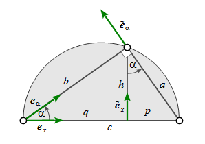

# The Right Triangle

## Base Geometry

Let the right triangle hypothenuse be aligned with the coordinate system *x-axis*. 
The vector loop closure equation running counter-clockwise then reads

$$a{\bold e}_\alpha + b\tilde{\bold e}_\alpha + c{\bold e}_x = \bold 0$$ (1)

with

$${\bold e}_\alpha = \begin{pmatrix}\cos\alpha\\ \sin\alpha\end{pmatrix} \quad and \quad {\tilde\bold e}_\alpha = \begin{pmatrix}-\sin\alpha\\ \cos\alpha\end{pmatrix}$$

Resolving for the hypothenuse part $c{\bold e}_x$ in the loop closure equation (1) 

$$-c{\bold e}_x = a{\bold e}_\alpha + b\tilde{\bold e}_\alpha$$

and squaring 

> finally results in the Pythagorean theorem (2)
>
> $$c^2 = a^2 + b^2$$ (2)

## More Triangle Stuff

Introducing the hypothenuse segments $p={\bold a}\cdot{\bold e}_x$ and  $q={\bold b}\cdot{\bold e}_x$, we can further obtain the following useful formulas.

| segment *p* | segment *q* | height *h* | area |
|:---:|:---:|:---:|:---:|
|$cp = a^2$|$cq = b^2$|$pq = h^2$|$ab = ch$|
